# ArcPageIndicator
A fully customizable super-easy Page Indicator, with stunning animations and original graphics, for Android. Needs a very small screen, perfect when many pages need to be shown and reached in a small time.

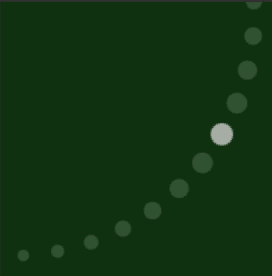

 

* Out-of-the-box working indicator
* Fully customizable and styleable
* Can be programmatically controlled

### Setup (Gradle)
In your project's build.gradle file:

    allprojects {
        repositories {
            ...
            maven { url "https://jitpack.io" }
            ...
        }
    }
    
In your Application's or Module's build.gradle file:

    dependencies {
        ...
        compile 'com.github.BeppiMenozzi:ArcPageIndicator:1.0.0'
        ...
    }
    
### Minimal usage
Layout for bottom 180° ellipse:

    ...
    xmlns:app="http://schemas.android.com/apk/res-auto"
    ...
    <it.beppi.arcpageindicator.ArcPageIndicator
        android:id="@+id/arc_pi"
        android:layout_width="400dp"
        android:layout_height="120dp"
        android:layout_alignParentBottom="true"
        android:layout_centerHorizontal="true"
        app:apiArcOrientation="toUp"
        app:apiViewPager="@id/view_pager"
        />

Layout for upper-left 90° ellipse:

    ...
    xmlns:app="http://schemas.android.com/apk/res-auto"
    ...
    <it.beppi.arcpageindicator.ArcPageIndicator
        android:id="@+id/arc_pi"
        android:layout_width="120dp"
        android:layout_height="120dp"
        android:layout_alignParentTop="true"
        android:layout_alignParentLeft="true"
        app:apiArcOrientation="toDownRight"
        app:apiViewPager="@id/view_pager"
        />

### Attributes description
List of attributes with description:
<table>
<tr><th colspan="2">General</th></tr>
<tr><td><b>apiViewPager</b></td><td>The ViewPager associated to the Indicator</td></tr>
<tr><th colspan="2">Arc appearance</th></tr>
<tr><td><b>apiArcOrientation</b></td><td>Orientation of the "belly" of the arc. This parameter also affects if the arc will be 90° (corner arc) or 180° (edge arc)</td></tr>
<tr><th colspan="2">Spot appearance</th></tr>
<tr><td><b>apiSpotsColor</b></td><td>Color of the spots</td></tr>
<tr><td><b>apiSelectedSpotColor</b></td><td>Color of the selected spot</td></tr>
<tr><td><b>apiSpotsRadius</b></td><td>Size of the spots</td></tr>
<tr><td><b>apiSpotsShape</b></td><td>Shape of the spots: Circle, RoundedSquare or Square</td></tr>
<tr><th colspan="2">Spots distribution and movement</th></tr>
<tr><td><b>apiIntervalMeasure</b></td><td>How spots are distributed on the circumference: constant angle or constant arc length</td></tr>
<tr><td><b>apiInvertDirection</b></td><td>If spots will be selected in inverted direction</td></tr>
<tr><td><b>apiAnimationType</b></td><td>See below to detailed explanation of animation types</td></tr>
<tr><th colspan="2">Hand appearance</th></tr>
<tr><td><b>apiHandEnabled</b></td><td>If hand is drawn</td></tr>
<tr><td><b>apiHandColor</b></td><td>Hand's color</td></tr>
<tr><td><b>apiHandWidth</b></td><td>Hand's width</td></tr>
<tr><td><b>apiHandRelativeLength</b></td><td>Hand's relative length starting from center to edges (1 = full length)</td></tr>
</table>

### Animation types
List of animation types:
<table>
<tr><td><b>Color</b></td><td>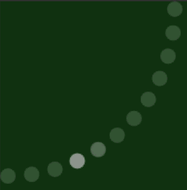</td><td>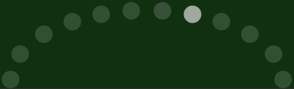</td></tr>
<tr><td><b>Slide</b></td><td>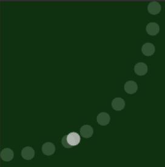</td><td>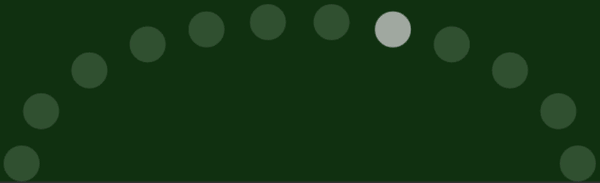</td></tr>
<tr><td><b>Pinch</b></td><td>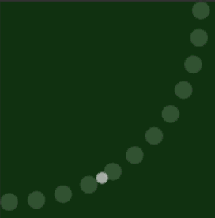</td><td></td></tr>
<tr><td><b>Bump</b></td><td></td><td></td></tr>
<tr><td><b>Rotate</b></td><td>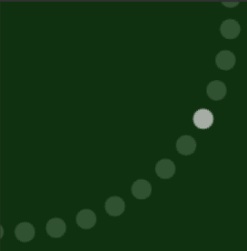</td><td>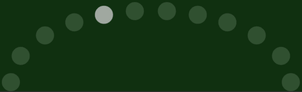</td></tr>
<tr><td><b>Rotate Pinch</b></td><td>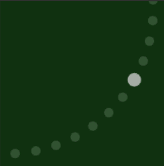</td><td></td></tr>
<tr><td><b>Cover</b></td><td>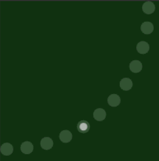</td><td>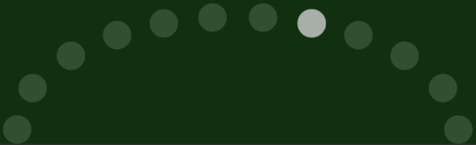</td></tr>
<tr><td><b>Fill</b></td><td>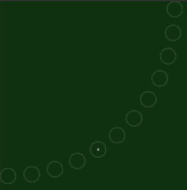</td><td>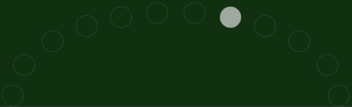</td></tr>
<tr><td><b>Surround</b></td><td>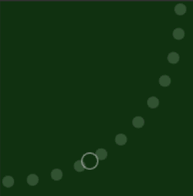</td><td>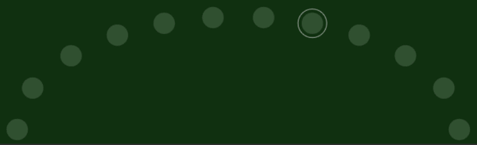</td></tr>
<tr><td><b>Necklace</b></td><td>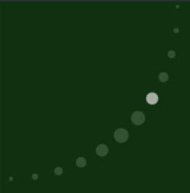</td><td></td></tr>
<tr></tr>
<tr><td><b>Necklace 2</b></td><td></td><td>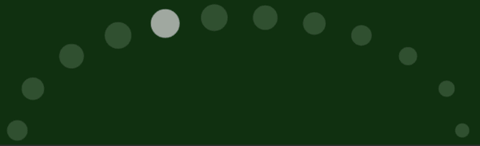</td></tr>
<tr><td><b>Example of hand</b></td><td>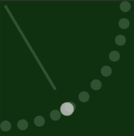</td><td></td></tr>
<tr><td><b>Example of rounded squared spots</b></td><td>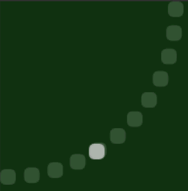</td><td>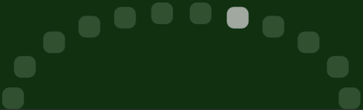</td></tr>
</table>
